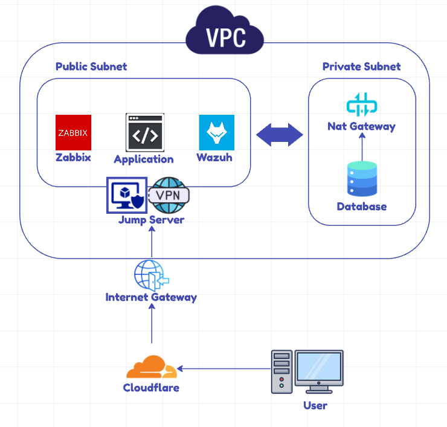

# Prova Final - Cibersegurança

Este projeto foi desenvolvido como parte da prova final da disciplina de Cibersegurança do 6º semestre de Ciência da Computação, ministrada pelo professor Rodolfo Avelino. O objetivo foi construir uma infraestrutura segura utilizando AWS.

## Diagrama da Infraestrutura

## Descrição do Projeto

### Resumo
Foi criada uma Virtual Private Cloud (VPC) com duas subnets:
- **Subnet Pública:** Contém máquinas que necessitam de acesso direto à internet.
- **Subnet Privada:** Contém máquinas que precisam de maior segurança, sem acesso direto à internet.

Foram configuradas 5 máquinas virtuais:

1. **Jump Server**
   - Serve como ponto de acesso inicial à infraestrutura.
   - Apenas usuários conectados à VPN podem utilizar o SSH para acessar outras máquinas.

2. **Infra**
   - Hospeda um serviço de API acessível para usuários externos.
   - Localizada na subnet pública.

3. **Wazuh**
   - Sistema de monitoramento de segurança.
   - Monitora todas as máquinas do ambiente.
   - Localizado na subnet pública.

4. **Zabbix**
   - Sistema de monitoramento de desempenho.
   - Monitora todas as máquinas do ambiente.
   - Localizado na subnet pública.

5. **Database (DB)**
   - Banco de dados MySQL utilizado pelas outras máquinas.
   - Localizado na subnet privada para maior segurança.
   - Comunicável apenas via NAT Gateway.

### Detalhes da Configuração
- Um **NAT Gateway** foi configurado para permitir que as máquinas na subnet privada façam atualizações e comunicação com a internet de forma controlada.
- O **Internet Gateway** foi configurado para permitir acesso à internet às máquinas na subnet pública.
- **Cloudflare** foi utilizado para adicionar uma camada extra de segurança, utilizando o domínio `abcplace.com.br`.
- Subdomínios configurados para acesso seguro via HTTPS, com certificados SSL:
  - **Wazuh Dashboard:** [wazuh.abcplace.com.br](https://wazuh.abcplace.com.br)
  - **Zabbix Dashboard:** [zabbix.abcplace.com.br/zabbix](https://zabbix.abcplace.com.br/zabbix)
  - **API:** [api.abcplace.com.br](https://api.abcplace.com.br)

### Segurança
- A comunicação SSH entre as máquinas é permitida somente através do **Jump Server**.
- Os sistemas de monitoramento (**Wazuh** e **Zabbix**) garantem a visibilidade do estado de cada máquina.
- O banco de dados está isolado em uma subnet privada, aumentando a segurança dos dados armazenados.

## Link do Vídeo Explicativo
[Adicione aqui o link para o vídeo explicativo]

## Membros do Grupo
- [Pedro Pertusi](https://github.com/PedroPertusi)
- [Joao Lucas](https://github.com/JoaoLucasMBC)
- [Eduardo Vaz](https://github.com/EduardoMVAz)
